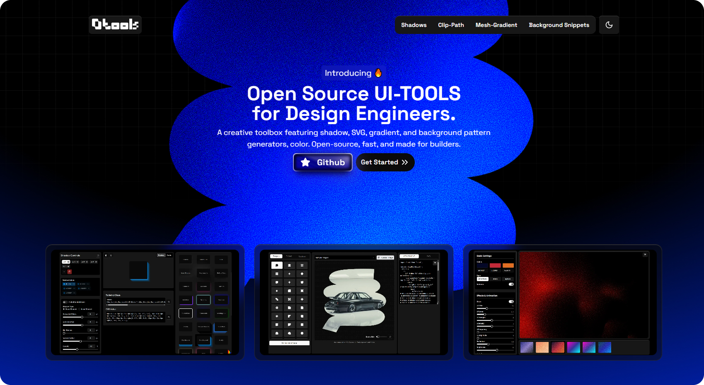

<br />
<p align="center">
  <a href="https://github.com/ui-layouts/ui-tools">
    
  </a>
<p>  

UI Tools is an open-source ui-tools for design engineers, developer. It's a creative toolbox featuring shadow, SVG, gradient, and background pattern generators, color. Open-source, fast, and made for builders.



## Installation

You must install `tailwindcss`. As most of our components use `motion` install it too.

```bash
npm install motion clsx tailwind-merge
```

Must Add it in the `utils.ts`:

```tsx title="utils.tsx"
import { type ClassValue, clsx } from "clsx";
import { twMerge } from "tailwind-merge";

export function cn(...inputs: ClassValue[]) {
  return twMerge(clsx(inputs));
}
```

use this hooks for mediaQueries:

```tsx title="use-media-query.tsx"
import { useEffect, useState } from "react";

export function useMediaQuery(query: string) {
  const [value, setValue] = useState(false);

  useEffect(() => {
    function onChange(event: MediaQueryListEvent) {
      setValue(event.matches);
    }

    const result = matchMedia(query);
    result.addEventListener("change", onChange);
    setValue(result.matches);

    return () => result.removeEventListener("change", onChange);
  }, [query]);

  return value;
}
```

## Tools

- [Mesh-Gradients](https://tools.ui-layouts.com/mesh-gradients)
- [Shadows](https://tools.ui-layouts.com/shadows)
- [Svg Clip-Path](https://tools.ui-layouts.com/clip-paths)
- [BG Snippets](https://tools.ui-layouts.com/background-snippets)


## TODO List

- [x] Shadows 
- [x] Svg Clip-Path  
- [x] BG Snippets
- [x] Mesh-Gradients
- [ ] Colors with Shadcn/themes


## 👤 Author (Naymur)

- X: [@naymur_dev](https://x.com/naymur_dev)
- LinkedIn: [in/naymur-rahman](https://www.linkedin.com/in/naymur-rahman/)

## Be A Sponsor

<a href="https://buymeacoffee.com/uilayouts"> </a>
<br/>
